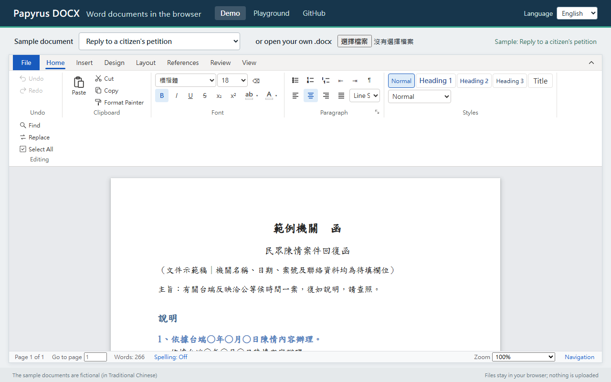

# Papyrus DOCX

**English** | [繁體中文](README.zh-TW.md) | [简体中文](README.zh-CN.md)

[](https://www.npmjs.com/package/papyrus-docx)
[](https://github.com/WUGINTING/FreeOnlineWordEditor/actions/workflows/ci.yml)
[](LICENSE)

A free, open-source editor that opens, edits and saves Word (.docx) files in the browser. It is
**designed so that saving changes only what you edited**, and leaves the rest of the file as Word wrote it.
Vue 3 + ProseMirror, MIT licensed. Files are handled entirely in the browser; no server is needed.



- **Live demo:** <https://wuginting.github.io/FreeOnlineWordEditor/>
- **Playground** (every option and event, for trying it before you integrate it):
  <https://wuginting.github.io/FreeOnlineWordEditor/playground.html>

## Status

- **Early (0.x).** Options and exported names may still change before 1.0.
- **One maintainer.** Issues and pull requests are welcome; answers may take a while.
- **The translations are machine-made and not yet reviewed by native speakers**: the English and
  Simplified Chinese interface ([src/papyrus/locales](src/papyrus/locales)) and this README.
  Corrections are welcome.
- **Found a document that comes back different after saving?** That is the bug this project most
  wants to hear about: please [open an issue](https://github.com/WUGINTING/FreeOnlineWordEditor/issues)
  with the file, or a cut-down copy that still shows it.

## Try it

Node 20 or newer.

```bash
npm install
npm run dev
```

Open the address the terminal shows. The demo page offers sample documents, or open a .docx of
your own; File › Download in the ribbon saves it back as a Word file.
`/playground.html` is the test page.

## The design principle: change only what was edited

Open → edit → save: only what the user changed is meant to be different; everything else is
meant to stay the same as the original file, element by element. This is how the editor is
built, not a guarantee for every document: see [Tests](#tests) for what it has been checked
against, and [Known limits](#known-limits).

- Every paragraph, run and table cell keeps Word's own formatting XML (w:pPr / w:rPr / w:tcPr /
  w:trPr, and attributes such as rsid and paraId); saving patches only the property that was changed.
- What the editor does not understand (charts, equations, bookmarks, field codes, content
  controls, tracked changes, comment marks …) is kept exactly as it was.

## Use it in your project

Three ways; pick one:

| Your project | How |
|---|---|
| A Vue 3 application | [Install the package, use the Vue component](#1-vue-3) |
| React, Angular, plain JavaScript … with a bundler | [Install the package, call `createDocxEditor`](#2-any-other-framework-or-plain-javascript) |
| A page without a bundler (JSP, PHP, static HTML …) | [One `<script>`](#3-one-script-no-build-step) |

### Install

```bash
npm install papyrus-docx
```

To use the newest code of the main branch before it is released, install straight from GitHub
(it builds itself while installing):

```bash
npm install github:WUGINTING/FreeOnlineWordEditor
```

TypeScript declarations are included; no `@types` package is needed.

### 1. Vue 3

```vue
<script setup lang="ts">
import { ref } from 'vue';
import { DocxEditorVue } from 'papyrus-docx';
import 'papyrus-docx/style.css';

const file = ref<Blob | null>(null); // the .docx to open; null is an empty document
const editor = ref<InstanceType<typeof DocxEditorVue> | null>(null);

async function save() {
  const blob: Blob = await editor.value!.save(); // the edited .docx
  // upload it, store it …
}
</script>

<template>
  <div style="height: 80vh">
    <DocxEditorVue ref="editor" :src="file" @error="console.error" />
  </div>
</template>
```

The editor fills the element around it, so that element needs a height.

| Prop | Meaning |
|---|---|
| `src` | The .docx to open (`Blob`, `ArrayBuffer` or `Uint8Array`); an empty document when omitted |
| `editable` | Whether the document can be edited (default `true`) |
| `toolbar` | Whether the ribbon is shown (default `true`) |
| `commenting` | Read-only, but comments can be added, replied to and resolved |
| `author` | The author of new comments |
| `fileMenu` | `true` when the page has a File menu of its own: the ribbon's 「檔案」 emits `file` instead |

Events: `ready` (the editor is there), `change` (the content changed), `error` (a file could not
be opened), `compat` (what in this document the web editor cannot fully show or edit), `size`,
`fonts`, `file`. The component exposes `save()`, `download(filename)` and `open(file)`.

### 2. Any other framework, or plain JavaScript

`createDocxEditor` puts the whole editor, ribbon included, into an element of yours. No Vue
knowledge is needed:

```ts
import { createDocxEditor } from 'papyrus-docx';
import 'papyrus-docx/style.css';

const editor = createDocxEditor('#editor', {   // an element, or a CSS selector
  src: file,                                   // the .docx to open; an empty document when omitted
  onChange: () => {},
  onError: (error) => console.error(error),
});

editor.open(anotherFile);               // show another document
const blob = await editor.save();       // the edited .docx
await editor.download('document.docx'); // have the browser download it
editor.destroy();                       // when the page goes away
```

The options are the props of the table above; the events become `onReady`, `onChange`,
`onError`, `onCompat`, `onSize`, `onFonts` and `onFile`. `editor.editor` is the editor itself,
for commands, the selection, undo and so on.

In React:

```tsx
import { useEffect, useRef } from 'react';
import { createDocxEditor, type DocxEditorHandle } from 'papyrus-docx';
import 'papyrus-docx/style.css';

export function WordEditor({ file }: { file: Blob | null }) {
  const host = useRef<HTMLDivElement>(null);
  const editor = useRef<DocxEditorHandle | null>(null);
  useEffect(() => {
    editor.current = createDocxEditor(host.current!, { src: file });
    return () => editor.current?.destroy();
  }, [file]);
  return <div ref={host} style={{ height: '80vh' }} />;
}
```

### 3. One script, no build step

`dist/papyrus-docx.standalone.iife.js` is a single file with everything inside (Vue and the
styles too). Load it, from a CDN as here or from a copy on your own site, and use the global
`PapyrusDocx`:

```html
<div id="editor" style="height: 80vh"></div>
<script src="https://cdn.jsdelivr.net/npm/papyrus-docx@0.1.0/dist/papyrus-docx.standalone.iife.js"></script>
<script>
  var editor = PapyrusDocx.createDocxEditor('#editor');
  // editor.open(file), editor.save(), editor.download('document.docx')
</script>
```

A complete page: [examples/script-tag.html](examples/script-tag.html) (run `npm run build`, then
open it in a browser). In the address above, `0.1.0` is the version of the package: name the
one you want, so that your page keeps working when a newer one comes out.

If you prefer an ES module, `papyrus-docx/standalone` (`dist/papyrus-docx.standalone.js`) has
the same content.

### Interface language

The interface comes in Traditional Chinese (`zh-TW`, the default), Simplified Chinese (`zh-CN`)
and English (`en`). Choose the language before creating the editor:

```ts
import { setLocale, createDocxEditor } from 'papyrus-docx';

setLocale(navigator.language);   // 'en-US' → en, 'zh-Hans-CN' → zh-CN, 'zh-HK' → zh-TW, anything else → en
// or: createDocxEditor('#editor', { locale: 'en' })   ·   <DocxEditorVue locale="en" />
```

The language is one for the whole page, not per editor. `setLocale` returns the language it used;
`locales()` lists the ones there are.

To change a text, or add a language of your own, give the texts with the source text (Traditional
Chinese) as the key: `addMessages('de', { '檔案': 'Datei', '尋找': 'Suchen' })`. A text a language
does not have is shown in Traditional Chinese. The full list of texts is
[src/papyrus/locales/en.ts](src/papyrus/locales/en.ts); `npm run i18n` says what each language
file lacks. Font names, style names and the document's own text are never translated.

### Reading and writing files only, without the interface

```ts
import { readDocx, writeDocx } from 'papyrus-docx';

const { doc, model } = await readDocx(bytes);   // Uint8Array / ArrayBuffer / Blob
const saved = await writeDocx(doc, model);      // the .docx again (Uint8Array)
```

Everything the package exports is listed in [src/papyrus/index.ts](src/papyrus/index.ts).

## Tests

```bash
npm test             # all tests
npm run type-check   # the type checker
```

To compare your own Word files element by element before and after saving (the files are not
changed):

```bash
DOCX_SAMPLES=<a folder of .docx files> npm test
```

The PowerShell scripts in `scripts/` open the saved files in desktop Microsoft Word and compare
there (Windows and Word are needed). During development 31 real documents were checked this way:
the same element by element after saving, and 31 of 31 the same in Microsoft Word. Those
documents are not part of this repository, so that check cannot be repeated from here; the
command above runs the element-by-element comparison on documents of your own.

## Layout of the project

```
src/papyrus/
  docx/reader.ts     .docx package → editor document (parts, styles, numbering, pictures, headers and footers)
  docx/convert.ts    WordprocessingML → editor content; what is not understood is kept as it is
  docx/props.ts      paragraph / run / cell formatting: the original kept, only the changed property patched
  docx/wrappers.ts   content controls, hyperlinks, revisions …: kept as layers and rebuilt
  docx/writer.ts     editor document → .docx (from the original file; only the text and changed headers / footers are rewritten)
  docx/styles.ts     styles.xml → CSS
  docx/numbering.ts  list numbering rules and counters
  editor/schema.ts   the document's structure (ProseMirror schema)
  editor/pagination.ts  measures blocks and inserts page-break spacers
  editor/core.ts     the editor itself, tied to no framework (header and footer editing included)
  vue/               the Vue component and the ribbon
  mount.ts           createDocxEditor: the editor in a page without Vue
demo/                the demo site: demo page and playground (npm run dev)
examples/            the one-script example
public/demo-docs/    sample documents (fictional)
tests/               tests
scripts/             Microsoft Word checking scripts
```

## Known limits

- Pages on screen are laid out paragraph by paragraph and table by table; this affects the display only, never the file.
- Charts, equations, SmartArt and footnote text are kept as they are but cannot be edited in the
  browser (text boxes and common shapes can be shown, retyped, moved and added).
- Tracked changes: the screen shows the document as with all changes accepted; the revision
  records stay in the file untouched.
- A recent browser is needed: Chrome / Edge 105, Firefox 121, Safari 15.5 or newer.
- Size: the package's script is about 1.1 MB (330 kB gzipped), to which your bundler adds Vue,
  ProseMirror and JSZip; the standalone single file is about 1.2 MB (430 kB gzipped).
- New shapes get a Chinese name (「矩形 1」) and the watermark presets are Chinese words in every
  interface language: both are written into the document.
- Node 22.12 crashes in a folder whose path has Chinese characters (a Node problem); use an
  ASCII path or a newer Node.

## License

[MIT](LICENSE)
