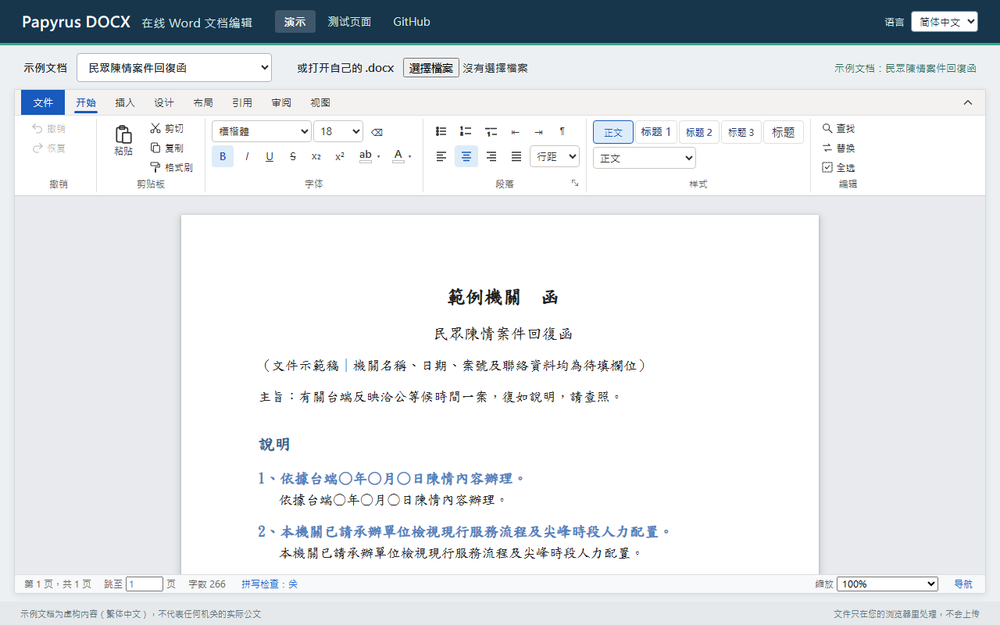

# Papyrus DOCX

[English](README.md) | [繁體中文](README.zh-TW.md) | **简体中文**

[](https://www.npmjs.com/package/papyrus-docx)
[](https://github.com/WUGINTING/FreeOnlineWordEditor/actions/workflows/ci.yml)
[](LICENSE)

免费、开源，在浏览器里打开、编辑、保存 Word（.docx）的编辑器。**设计目标是保存时只改动你编辑过的地方**，
其余部分保持 Word 原本写出来的样子。
Vue 3 + ProseMirror，MIT 许可。文件全程在浏览器里处理，不需要服务器。



- **在线演示：** <https://wuginting.github.io/FreeOnlineWordEditor/>
- **测试页面**（所有选项与事件都能试，适合集成前先体验）：
  <https://wuginting.github.io/FreeOnlineWordEditor/playground.html>

这个编辑器是从零编写的，代码大部分由 AI 编程助手（Claude）撰写。设计依据是 Office Open XML（ECMA-376）
公开标准；功能清单参考过 SuperDoc 的公开功能介绍，没有参考它的源代码。
参考过哪些资料记录在 [CLEAN_ROOM.md](CLEAN_ROOM.md)。

## 项目状态

- **早期版本（0.x）。** 1.0 之前，选项与导出的名称还可能调整。
- **一个人维护。** 欢迎提交问题与 pull request，回复可能需要一些时间。
- **翻译是机器生成的，还没有经过母语人士校对**：英文与简体中文的界面
  （[src/papyrus/locales](src/papyrus/locales)）以及英文、简体中文的 README。欢迎指正。
- **发现某份文档保存后跟原来不一样？** 这是这个项目最想知道的问题：请附上文件（或仍能重现的精简版）
  [提交问题](https://github.com/WUGINTING/FreeOnlineWordEditor/issues)。

## 马上试试

需要 Node 20 以上。

```bash
npm install
npm run dev
```

打开终端显示的地址，就会看到演示页：可以选一份示例文档，或打开自己电脑里的 .docx，
编辑后用工具栏的「文件 › 下载」存回 Word 文件。`/playground.html` 是测试页面。

## 设计原则：只改动编辑过的地方

打开 → 编辑 → 保存，设计上只有用户改的地方会变，其余部分与原文件逐元素相同。
这是编辑器的做法，不是对每一份文档的保证：验证过哪些情况见[测试](#测试)，做不到的事见[已知限制](#已知限制)。

- 每个段落、文字、表格单元格都保留 Word 原本的格式 XML（w:pPr / w:rPr / w:tcPr / w:trPr，
  以及 rsid、paraId 等属性），保存时只修补用户改过的那一项。
- 编辑器看不懂的内容（图表、公式、书签、域代码、内容控件、修订、批注标记……）
  一律原样保留。

## 用在自己的项目

三种引入方式，选一种即可：

| 你的项目 | 用法 |
|---|---|
| Vue 3 项目 | [安装包，使用 Vue 组件](#1-vue-3-项目) |
| React、Angular、纯 JavaScript 等有打包工具的项目 | [安装包，使用 `createDocxEditor`](#2-其他框架或纯-javascript) |
| 没有打包工具的网页（JSP、PHP、静态 HTML……） | [一行 `<script>`](#3-一行-script不需要打包工具) |

### 安装

```bash
npm install papyrus-docx
```

想用 main 分支上还没发布的最新代码，可以直接从 GitHub 安装（安装时会自动构建）：

```bash
npm install github:WUGINTING/FreeOnlineWordEditor
```

包内附带 TypeScript 类型，不需要另外安装 `@types`。

### 1. Vue 3 项目

```vue
<script setup lang="ts">
import { ref } from 'vue';
import { DocxEditorVue } from 'papyrus-docx';
import 'papyrus-docx/style.css';

const file = ref<Blob | null>(null); // 要打开的 .docx；null 则是空白文档
const editor = ref<InstanceType<typeof DocxEditorVue> | null>(null);

async function save() {
  const blob: Blob = await editor.value!.save(); // 编辑后的 .docx
  // 上传、另存……
}
</script>

<template>
  <div style="height: 80vh">
    <DocxEditorVue ref="editor" :src="file" @error="console.error" />
  </div>
</template>
```

编辑器会填满外层元素，所以外层要有高度。

| 属性 | 说明 |
|---|---|
| `src` | 要打开的 .docx（`Blob`、`ArrayBuffer` 或 `Uint8Array`）；不传就是空白文档 |
| `editable` | 能否编辑（默认 `true`） |
| `toolbar` | 是否显示工具栏（默认 `true`） |
| `commenting` | 只读，但可以新增、回复、解决批注 |
| `author` | 新批注的作者 |
| `fileMenu` | 页面有自己的“文件”菜单时设为 `true`，工具栏的「檔案」改为触发 `file` 事件 |

事件：`ready`（编辑器已就绪）、`change`（内容有变）、`error`（文件无法打开）、
`compat`（这份文档里有哪些内容网页上无法完整显示或编辑）、`size`、`fonts`、`file`。
组件上可以调用 `save()`、`download(文件名)`、`open(文件)`。

### 2. 其他框架或纯 JavaScript

`createDocxEditor` 把整个编辑器（含工具栏）放进你指定的元素，不需要懂 Vue：

```ts
import { createDocxEditor } from 'papyrus-docx';
import 'papyrus-docx/style.css';

const editor = createDocxEditor('#editor', {   // 元素，或 CSS 选择器
  src: file,                                   // 要打开的 .docx；不传就是空白文档
  onChange: () => {},
  onError: (error) => console.error(error),
});

editor.open(anotherFile);            // 换一份文档
const blob = await editor.save();    // 编辑后的 .docx
await editor.download('文档.docx');  // 让浏览器下载
editor.destroy();                    // 离开页面时销毁
```

选项与上表的属性相同；事件改成 `onReady`、`onChange`、`onError`、`onCompat`、`onSize`、
`onFonts`、`onFile`。`editor.editor` 是编辑器本体，可以用来执行命令、读取选区、撤销等。

React 的写法：

```tsx
import { useEffect, useRef } from 'react';
import { createDocxEditor, type DocxEditorHandle } from 'papyrus-docx';
import 'papyrus-docx/style.css';

export function WordEditor({ file }: { file: Blob | null }) {
  const host = useRef<HTMLDivElement>(null);
  const editor = useRef<DocxEditorHandle | null>(null);
  useEffect(() => {
    editor.current = createDocxEditor(host.current!, { src: file });
    return () => editor.current?.destroy();
  }, [file]);
  return <div ref={host} style={{ height: '80vh' }} />;
}
```

### 3. 一行 script（不需要打包工具）

`dist/papyrus-docx.standalone.iife.js` 一个文件就包含全部（Vue、样式都在里面），
从 CDN 加载（如下），或把文件放到自己的网站，然后使用全局的 `PapyrusDocx`：

```html
<div id="editor" style="height: 80vh"></div>
<script src="https://cdn.jsdelivr.net/npm/papyrus-docx@0.1.0/dist/papyrus-docx.standalone.iife.js"></script>
<script>
  var editor = PapyrusDocx.createDocxEditor('#editor');
  // editor.open(file)、editor.save()、editor.download('文档.docx')
</script>
```

完整示例见 [examples/script-tag.html](examples/script-tag.html)（先 `npm run build`，再用浏览器打开）。
上面地址里的 `0.1.0` 是包的版本：请写明要用的版本，新版本出来时你的页面才不会跟着变。

偏好 ES 模块的话，用 `papyrus-docx/standalone`（`dist/papyrus-docx.standalone.js`），内容相同。

### 界面语言

界面有繁体中文（`zh-TW`，默认）、简体中文（`zh-CN`）与英文（`en`）。请在创建编辑器之前选好语言：

```ts
import { setLocale, createDocxEditor } from 'papyrus-docx';

setLocale(navigator.language);   // 'en-US' → en、'zh-Hans-CN' → zh-CN、'zh-HK' → zh-TW，其他 → en
// 或： createDocxEditor('#editor', { locale: 'en' })   ·   <DocxEditorVue locale="en" />
```

语言是整个页面共用一种，不是每个编辑器各自设置。`setLocale` 会返回实际使用的语言；`locales()` 列出有哪些语言。

想改某一句，或加上自己的语言，用原文（繁体中文）作为键把文字交给它：
`addMessages('de', { '檔案': 'Datei', '尋找': 'Suchen' })`。某个语言没有的句子会以繁体中文显示。
完整的文字清单在 [src/papyrus/locales/en.ts](src/papyrus/locales/en.ts)；`npm run i18n` 会列出每个语言文件还缺哪些。
字体名称、样式名称与文档本身的内容不会被翻译。

### 只读写文件，不要界面

```ts
import { readDocx, writeDocx } from 'papyrus-docx';

const { doc, model } = await readDocx(bytes);   // Uint8Array / ArrayBuffer / Blob
const saved = await writeDocx(doc, model);      // 编辑后的 .docx（Uint8Array）
```

导出的项目都列在 [src/papyrus/index.ts](src/papyrus/index.ts)。

## 测试

```bash
npm test             # 全部测试
npm run type-check   # 类型检查
```

用自己的 Word 文件做“保存前后逐元素比对”（文件不会被修改）：

```bash
DOCX_SAMPLES=<放 .docx 的文件夹> npm test
```

`scripts/` 里的 PowerShell 脚本会用桌面版 Microsoft Word 打开保存后的文件做比对
（需要 Windows 与 Word）。开发期间以 31 份真实文档验证过：保存前后逐元素相同、
Microsoft Word 比对 31/31 相同。那些文档不属于这个仓库，所以没有附上，这项验证无法从这里重做；
上面的命令可以对你自己的文档做逐元素比对。

## 项目结构

```
src/papyrus/
  docx/reader.ts     .docx 包 → 编辑器文档（找出各部件、样式、编号、图片、页眉页脚）
  docx/convert.ts    WordprocessingML → 编辑器内容；看不懂的一律原样保留
  docx/props.ts      段落 / 文字 / 单元格格式：保留原稿，只修补改过的项目
  docx/wrappers.ts   内容控件、超链接、修订等外层结构的保存与重建
  docx/writer.ts     编辑器文档 → .docx（以原文件为底，只重写正文与改过的页眉页脚）
  docx/styles.ts     styles.xml → CSS
  docx/numbering.ts  列表编号规则与计数
  editor/schema.ts   文档结构定义（ProseMirror schema）
  editor/pagination.ts  测量区块高度，插入分页垫片
  editor/core.ts     不绑定框架的编辑器主体（含页眉页脚编辑）
  vue/               Vue 组件与工具栏
  mount.ts           createDocxEditor：不用 Vue 也能放进页面
demo/                演示网站：演示页与测试页面（npm run dev）
examples/            一行 script 的用法示例
public/demo-docs/    示例文档（虚构内容）
tests/               测试
scripts/             Microsoft Word 验证脚本
```

## 已知限制

- 屏幕上的分页以段落 / 表格为单位；只影响显示，不影响文件内容。
- 图表、公式、SmartArt、脚注内容只能原样保留，不能在网页上编辑（文本框与常见形状可以显示、改字、移动与新增）。
- 修订：屏幕显示“接受所有修订”后的样子；修订记录原样保留在文件里。
- 需要较新的浏览器：Chrome / Edge 105、Firefox 121、Safari 15.5 以上。
- 大小：包本身的脚本约 1.1 MB（gzip 后 330 kB），打包时还会加上 Vue、ProseMirror 与 JSZip；
  单文件版约 1.2 MB（gzip 后 430 kB）。
- 新插入的形状名称（「矩形 1」）与水印的预设文字，在任何界面语言下都是中文：两者都会写进文档。
- Node 22.12 在含中文字符的文件夹路径下会崩溃（Node 本身的问题），请放在英文路径或升级 Node。

## 许可

[MIT](LICENSE)
